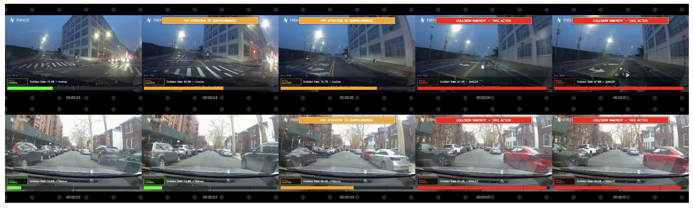
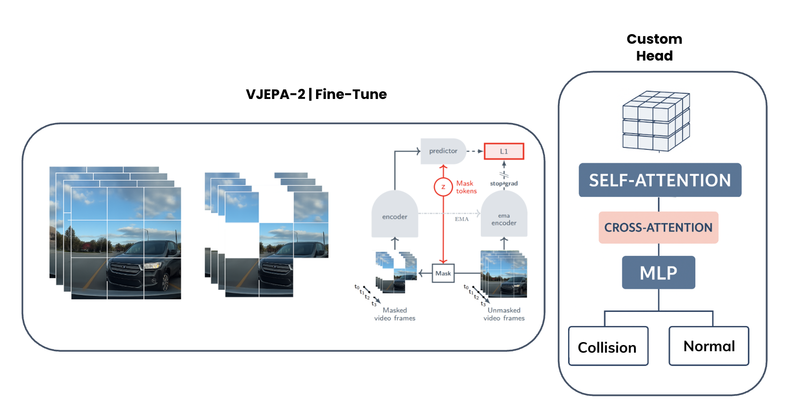

# BADAS-Open: State-of-the-Art Ego-Centric Collision Prediction

<div align="center">

[](https://www.python.org/downloads/)
[](https://pytorch.org/)
[](https://opensource.org/licenses/Apache-2.0)
[](https://arxiv.org/abs/2025.xxxxx)
[](https://huggingface.co/nexar-ai/badas-open)
[](https://nexar-ai.github.io/badas-open)



**[Demo](https://play.nexar-ai.com) | [Paper](https://arxiv.org/abs/2025.xxxxx) | [Dataset](https://huggingface.co/datasets/nexar-ai/nexar_collision_prediction) | [Models](https://huggingface.co/nexar-ai/badas-open)**

</div>

## 🎯 Overview

**BADAS-Open** (V-JEPA2 Based Advanced Driver Assistance System) is a state-of-the-art collision prediction model specifically designed for **ego-centric** threat detection in real-world driving scenarios. Unlike traditional methods that detect any visible accident, BADAS focuses exclusively on collisions that directly threaten the recording vehicle.

### Key Differentiators

- 🎯 **Ego-Centric Focus**: Only predicts collisions threatening the ego vehicle, reducing false alarms by 85%
- 🚗 **Real-World Performance**: Trained on 1,500+ real dashcam videos with expert-validated annotations
- ⚡ **Production Ready**: Optimized for real-time inference on edge devices
- 🧠 **Foundation Model**: Built on Meta's V-JEPA2 for superior temporal understanding

## 📊 Performance

BADAS-Open achieves state-of-the-art results across all major benchmarks:

<div align="center">

</div>

| Dataset | AP ↑ | AUC ↑ | mTTA (s) ↓ | FPS |
|---------|------|-------|------------|-----|
| **Nexar** | **0.86** | **0.88** | 4.9 | 45 |
| **DoTA** | **0.94** | **0.70** | 4.0 | 52 |
| **DADA-2000** | **0.87** | **0.77** | 4.3 | 48 |
| **DAD** | **0.66** | **0.87** | 2.7 | 50 |

*Outperforms previous SOTA (DSTA, UString) by 30-80% on AP metric*

### What Makes This Different?

Traditional collision prediction models are trained to detect **any accident in the camera's view**, leading to excessive false alarms from irrelevant incidents (e.g., accidents in adjacent lanes). BADAS solves this by:

1. **Ego-Centric Reformulation**: Only predicting collisions that directly threaten the ego vehicle
2. **Real-World Data**: Trained on actual dashcam footage, not synthetic or staged scenarios  
3. **Consensus-Based Timing**: Alert times validated by 10 certified defensive driving experts
4. **Near-Miss Inclusion**: Learning from successfully-avoided dangerous situations

<p align="center">
  
  <br>
  <em>Example: BADAS prediction on real dashcam footage</em>
</p>

## 🚀 Quick Start

### Installation

```bash
# Install from PyPI
pip install badas

# Or install from source
git clone https://github.com/nexar-ai/badas-open.git
cd badas-open
pip install -e .
```

### Basic Usage

```python
from badas import BADASModel

# Initialize model
model = BADASModel(device="cuda")  # or "cpu" for CPU inference

# Predict on video
predictions = model.predict("dashcam_video.mp4")

# Get collision risk for each frame window
for i, prob in enumerate(predictions):
    if prob > 0.8:
        print(f"⚠️ High collision risk at {i*0.125:.1f}s: {prob:.2%}")
```

### Advanced Usage

```python
import torch
from badas import load_badas_model, preprocess_video

# Load model with custom configuration
model = load_badas_model(
    device="cuda",
    checkpoint_path="path/to/custom_checkpoint.pth"  # Optional
)

# Preprocess video manually for batch processing
frames = preprocess_video(
    "dashcam_video.mp4",
    target_fps=8,
    num_frames=16,
    img_size=224
)

# Run inference
with torch.no_grad():
    collision_probs = model(frames)
    
# Estimate time to collision
tta = model.estimate_time_to_accident(collision_probs, fps=8.0)
if tta is not None:
    print(f"🚨 Collision in {tta:.1f} seconds!")
```

## 🏗️ Architecture

<div align="center">

</div>

BADAS leverages a sophisticated architecture combining:
- **V-JEPA2 Backbone**: Vision Joint-Embedding Predictive Architecture for temporal understanding
- **Attentive Probe**: 12 learned queries for spatial-temporal aggregation
- **MLP Head**: 3-layer prediction head with GELU activation and LayerNorm

## 📚 Documentation

- **[Getting Started Guide](docs/getting_started.md)**: Installation and basic usage
- **[API Reference](docs/api_reference.md)**: Detailed API documentation
- **[Model Zoo](docs/model_zoo.md)**: Pre-trained model variants
- **[Training Guide](docs/training.md)**: Fine-tune on custom data
- **[Deployment Guide](docs/deployment.md)**: Production deployment strategies

## 🔬 Research

### Citation

If you use BADAS in your research, please cite our paper:

```bibtex
@article{goldshmidt2025badas,
  title={BADAS: Context-Aware Collision Prediction Using Real-World Dashcam Data},
  author={Goldshmidt, Roni and Scott, Hamish and Niccolini, Lorenzo and 
          Zhu, Shizhan and Moura, Daniel and Zvitia, Orly},
  journal={arXiv preprint arXiv:2025.xxxxx},
  year={2025}
}
```

### Dataset

The Nexar Collision Prediction Dataset used to train BADAS is available at:
- 🤗 [HuggingFace Dataset](https://huggingface.co/datasets/nexar-ai/nexar_collision_prediction)
- 🏆 [Kaggle Competition](https://www.kaggle.com/competitions/nexar-collision-prediction)

## 💻 Development

### Setting Up Development Environment

```bash
# Clone repository
git clone https://github.com/nexar-ai/badas-open.git
cd badas-open

# Install in development mode
pip install -e ".[dev]"

# Run tests
pytest tests/

# Format code
black badas/
isort badas/
```

### Running Examples

```bash
# Basic inference example
python examples/basic_inference.py

# Batch processing example
python examples/batch_processing.py

# Real-time demo
python examples/realtime_demo.py
```

## 🤝 Contributing

We welcome contributions! Please see our [Contributing Guidelines](CONTRIBUTING.md) for details.

### Areas for Contribution

- 🔧 Performance optimizations
- 📱 Mobile/edge deployment
- 🌍 Multi-region dataset expansion
- 📊 Evaluation metrics
- 📝 Documentation improvements

## 📄 License

This project is licensed under the Apache License 2.0 - see the [LICENSE](LICENSE) file for details.

## 🙏 Acknowledgments

- **V-JEPA2 Foundation Model** by Meta AI Research
- **Nexar Driver Community** for dataset contribution
- **Academic Partners** for benchmark annotations

## 🔗 Links

- 🌐 **Website**: [nexar.ai/badas](https://nexar.ai/badas)
- 📧 **Contact**: research@nexar.com
- 💬 **Discord**: [Join our community](https://discord.gg/nexar-ai)
- 🐦 **Twitter**: [@NexarAI](https://twitter.com/NexarAI)

## ⚠️ Disclaimer

This model is intended for research and development purposes. It should not be used as the sole decision-making system for vehicle safety. Always maintain full attention while driving and follow all traffic laws and safety regulations.

---

<div align="center">
  <sub>Built with ❤️ by <a href="https://nexar.ai">Nexar AI Research</a></sub>
</div>